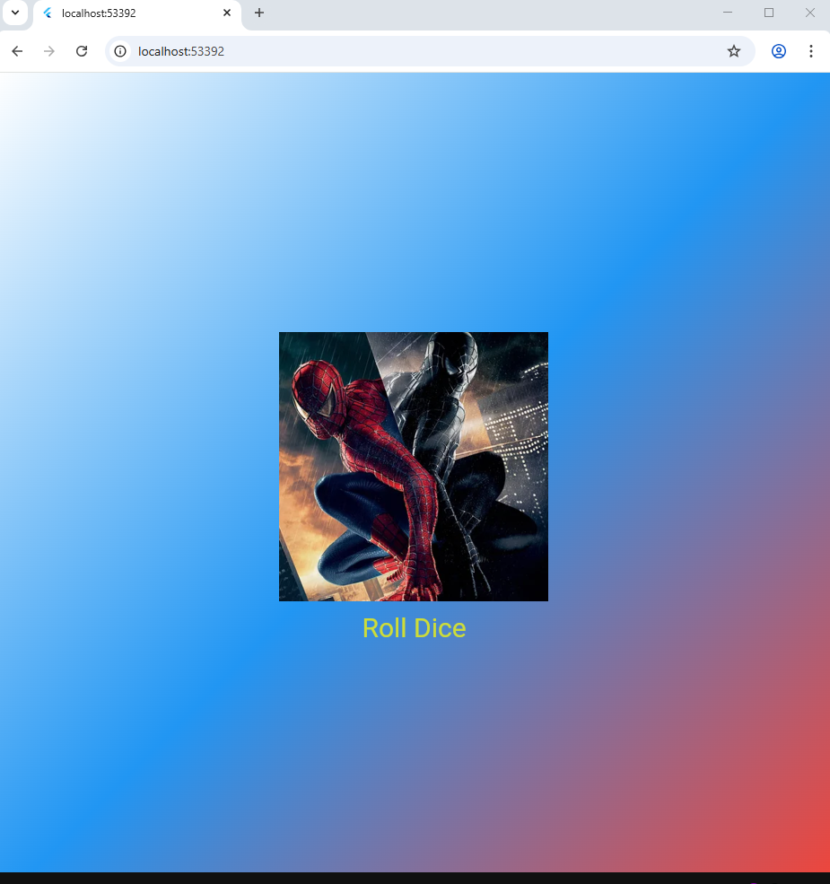

# Лабораторная работа №3: Основы Flutter и виджеты

## Информация о студенте
- **ФИО:** Беляев В.А. и Селиванов П.А.
- **Группа:** ИСП-233
- **Дата сдачи:** 25 апреля 2026 г.

## Что изучено в ходе работы
1. **Создание и разделение виджетов** — научился выносить виджеты в отдельные файлы для улучшения структуры проекта.
2. **StatefulWidget и StatelessWidget** — понял разницу между статическими и динамическими виджетами, научился управлять состоянием.
3. **Генерация случайных чисел** — реализовал механизм "бросания кубика" с обновлением UI.
4. **Работа с ресурсами (assets)** — подключил изображения для кубиков в проект.
5. **Сборка интерфейса** — освоил компоновку виджетов Column, SizedBox, ElevatedButton и Image.asset.

## Скриншот финального приложения



## Ссылка на репозиторий
[GitHub - flutter_lab3_app](https://github.com/VladimirBelyaev01/Fl_Lab3_NoHomwork.git)

## Инструкция по запуску
1. Клонируйте репозиторий:
   ```bash
   git clone https://github.com/VladimirBelyaev01/Fl_Lab3_NoHomwork.git
2. Перейдите в папку проекта:
    cd flutter_lab3_app
3. Установите зависимости:
    flutter pub get
4. Запустите приложение:
    flutter run

## Ответы на вопросы
1. Зачем выносить виджеты в отдельные файлы? Что изменится если держать всё в main.dart?

Вынесение виджетов в отдельные файлы обеспечивает улучшенную читаемость кода, так как каждый файл отвечает за свою логику. Это позволяет переиспользовать виджеты в разных частях приложения, упрощает отладку и делает проект масштабируемым. Если держать всё в main.dart, файл быстро разрастётся до тысяч строк, станет сложным для навигации, а при работе в команде будут возникать постоянные конфликты при слиянии изменений в Git.

2. Что такое BuildContext? Почему метод build() принимает его как параметр?

BuildContext - это местонахождение виджета в дереве виджетов. Он содержит информацию о позиции виджета и позволяет находить родительские виджеты, получать тему приложения и осуществлять навигацию между экранами. Метод build() принимает BuildContext, потому что при сборке UI виджету нужно знать своё окружение: где он находится, какие данные доступны выше по дереву, как стилизовать себя согласно теме.

3. Чем StatelessWidget отличается от StatefulWidget? Приведите пример когда нужен каждый из них.

StatelessWidget не может измениться после создания и имеет только метод build(). StatefulWidget может менять своё состояние и обновлять UI через вызов setState(). StatelessWidget нужен для статических элементов: иконка, статический текст, кнопка с фиксированным действием. StatefulWidget нужен для динамических элементов: счётчик кликов, поле ввода, анимация, таймер. В данной лабораторной работе кубик при клике меняет изображение, поэтому используется StatefulWidget.

4. Почему Random() создаётся на уровне файла, а не внутри rollDice()?

Random() создаётся один раз на уровне файла по нескольким причинам. Во-первых, это повышает производительность, так как не нужно создавать новый объект при каждом броске. Во-вторых, это улучшает качество случайности: при частом создании Random() внутри метода можно получить одинаковые или предсказуемые значения из-за одинакового seed'а по времени. В-третьих, переиспользование одного экземпляра Random даёт более равномерное распределение случайных чисел.

